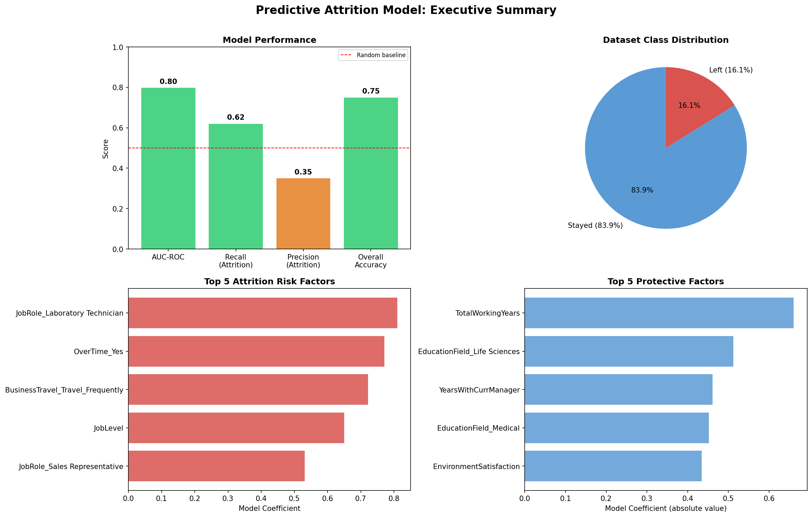

# Predictive Attrition Model
**IBM HR Analytics Dataset | Python | scikit-learn | Logistic Regression**

## Project Overview
This project builds on a prior SQL-based attrition analysis to develop a 
machine learning model that predicts which employees are at risk of leaving. 
The goal is to produce actionable, interpretable findings for HR leadership 
rather than optimize purely for accuracy.

This is Phase 2 of a two-part People Analytics portfolio project:
- Phase 1: [SQL Attrition Analysis](https://github.com/ngmozzi/hr-analytics-attrition-sql)
- Phase 2: This repository

## Dataset
- **Source:** IBM HR Analytics Employee Attrition dataset (publicly available)
- **Size:** 1,470 employees, 35 features
- **Target variable:** Attrition (Yes/No), 16.1% positive rate

## Key Findings

### Model Performance
| Metric | Score |
|--------|-------|
| AUC-ROC | 0.80 |
| Recall (Attrition) | 0.62 |
| Overall Accuracy | 0.75 |

The model correctly identified 62% of employees who left in the holdout 
test set, well above the random baseline of 50% AUC.

### Top Attrition Risk Factors
1. **JobRole: Laboratory Technician** - highest risk role in the dataset
2. **OverTime** - employees working overtime leave at nearly 3x the base rate
3. **Frequent Business Travel** - strong demands factor consistent with JD-R model
4. **Low Job Level** - entry-level employees are significantly more flight-risk
5. **JobRole: Sales Representative** - high demands, high turnover role

### Top Protective Factors
1. **Total Working Years** - tenure is the strongest retention signal
2. **Years with Current Manager** - stable manager relationships retain employees
3. **Environment Satisfaction** - workplace environment quality matters significantly
4. **Education Field: Life Sciences / Medical** - field-specific retention patterns

## Methodology
- Removed constant/identifier columns (EmployeeCount, EmployeeNumber, etc.)
- One-hot encoded 7 categorical variables using pandas get_dummies
- Applied StandardScaler to normalize numeric features
- 80/20 stratified train/test split to preserve class distribution
- Used class_weight='balanced' in Logistic Regression to address 84/16 imbalance
- Evaluated using AUC-ROC and recall rather than raw accuracy

## Notable Analytical Decisions
**Why Logistic Regression over a more complex model:** Interpretability for 
HR audiences matters more than marginal accuracy gains. A logistic regression 
coefficient can be explained in a meeting; a gradient boosted tree cannot.

**Why AUC-ROC over accuracy:** A naive model predicting "No" for every employee 
achieves 83.9% accuracy while catching zero attrition cases. AUC-ROC measures 
the model's ability to rank at-risk employees above stable ones regardless of 
threshold.

## Executive Summary

## Tools Used
- Python 3.12, Jupyter Notebook, VS Code
- pandas, scikit-learn, seaborn, matplotlib

## Related Project
[Phase 1: SQL Attrition Analysis](https://github.com/ngmozzi/hr-analytics-attrition-sql)
